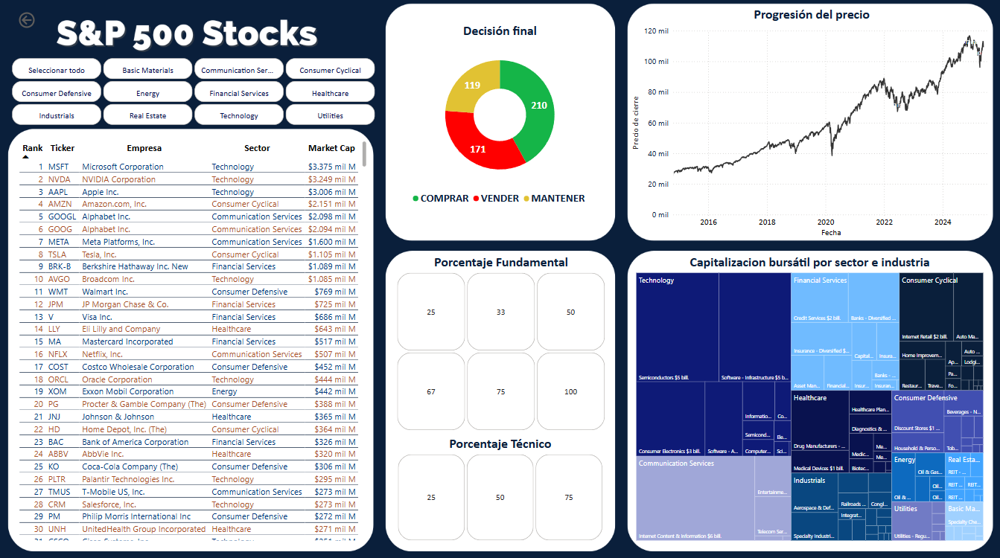
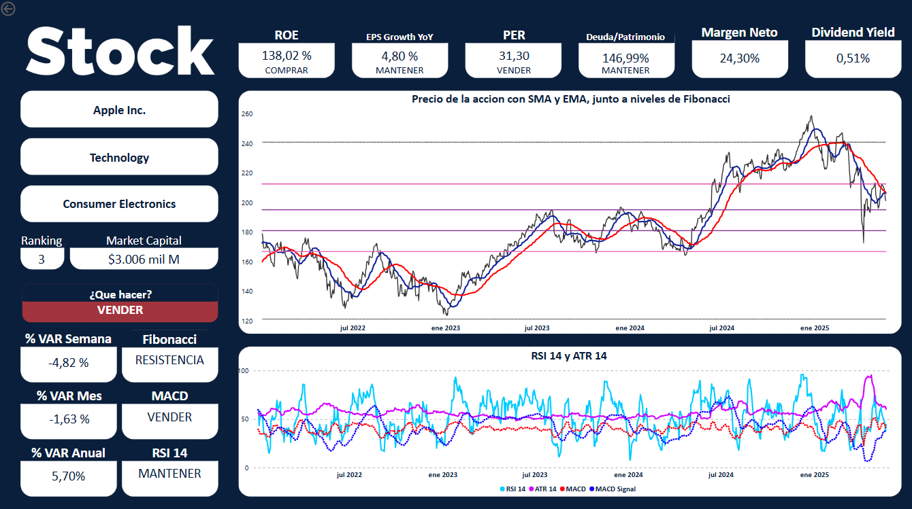

# 📈 Proyecto Final: Análisis de Acciones del NYSE

---

## 🚀 Descripción General

Este proyecto implementa un pipeline ETL (Extracción, Transformación y Carga) completo para construir una base de datos actualizada diariamente con información sobre las 500 empresas de mayor capitalización bursátil del NYSE (S&P 500).

Permite:
- Descargar y limpiar datos de precios históricos y fundamentales.
- Calcular indicadores técnicos y fundamentales clave.
- Almacenar todo en PostgreSQL para su posterior análisis y modelado.
- Generar reportes y dashboards para apoyar decisiones de inversión.
- Realizar Análisis Exploratorio de Datos (EDA) detallado para obtener insights valiosos.
- Generar señales automáticas de compra, venta o mantener combinando análisis técnico y fundamental.
- Visualizar el ecosistema en dashboards interactivos con Power BI.

---

## 🎯 Objetivos

### Objetivos Mínimos:
- Extracción de datos históricos y fundamentales usando Yahoo Finance (`yfinance`).
- Transformación, limpieza y cálculo de indicadores técnicos (SMA, EMA, RSI, MACD, Bollinger Bands, ATR, OBV, Volatilidad, Fibonacci) y fundamentales (PER, ROE, EPS Growth, Deuda/Patrimonio, Market Cap, Dividend Yield).
- Almacenamiento en base de datos relacional PostgreSQL.
- Análisis Exploratorio de Datos (EDA).
- Desarrollo de dashboards de visualización en Power BI.

### Objetivos Plus:
- Automatización diaria de la actualización de datos.
- Democratizar el acceso a datos financieros de calidad para pequeños inversores.
- Generación automática de recomendaciones de inversión.
- Base para desarrollo futuro de modelos predictivos y aplicación web.

---

## 🧩 Estructura del Pipeline ETL

| Fase | Scripts | Descripción |
|:----|:--------|:------------|
| **Extracción** | `etl_01_ext.py`, `etl_02_ext_diario.py` | Descarga inicial y actualización diaria de datos desde Yahoo Finance y Wikipedia. |
| **Transformación** | `etl_03_transform.py` | Limpieza de datos y cálculo de indicadores técnicos y fundamentales. |
| **Carga** | `etl_04_load.py` | Inserción incremental en PostgreSQL, controlando duplicados y actualizaciones. |
| **Orquestación** | `main.py` | Automatización completa del proceso ETL. |

---

## 📊 Variables de Interés

- **Históricos**: Open, High, Low, Close, Volume.  
- **Fundamentales**: PER, ROE, EPS Growth, Deuda/Patrimonio, Market Cap, Dividend Yield, Sector, Industria.  
- **Técnicos**:  
  - Media Móvil Simple (SMA)  
  - Media Móvil Exponencial (EMA)  
  - Relative Strength Index (RSI)  
  - MACD  
  - Bollinger Bands  
  - Average True Range (ATR)  
  - On-Balance Volume (OBV)  
  - Volatilidad Histórica  
  - Niveles de Fibonacci  

---

## 📈 Análisis Exploratorio de Datos (EDA)

El análisis exploratorio permitió detectar:
- Columnas con alta proporción de nulos (`EPS Growth YoY`, `Dividend Yield`).
- Variables con sesgo como `PER` y `Market Cap`, ideales para transformaciones logarítmicas.
- Fuertes correlaciones entre variables como `Market Cap` y `Dividend Yield`.
- Outliers identificados con Z-score y boxplots.
- Comportamientos temporales y fechas clave (como marzo 2020).

### Recomendaciones:
- Usar mediana para imputaciones en lugar de la media.
- Realizar normalización y selección de features para modelado.
- Aprovechar patrones temporales en modelos predictivos o alertas.

---
## 📁 Estructura del Repositorio

```plaintext
Proyecto_Final/
├── consultas_SQL/
│   ├── Carga_tablas.sql
│   ├── consultas_APPL.sql
│   ├── consultas_APPL_AVANZADAS.sql
│   └── consultas_APPL_PRO.sql
│
├── dashboards/
│   └── dashboard.pbix
│
├── documentacion/
│   ├── 01.Analisis_acciones_NYSE.md
│   ├── 02.Documentación_ETL.md
│   ├── 03.Documetacion_Informe_EDA.md
│   └── esquema_bbdd.png
│
├── entregables/
│   ├── 01.Definicion_Proyecto_Analisis_Acciones.md
│   ├── 02.Documentacion_ETL_Proyecto_Final.md
│   ├── 03.Informe_EDA_Completo_Resultados.md
│   └── Trabajo_Final_DataAnalyticsHackio.md
│
├── notebooks/
│   ├── clean/
│   │   └── EDA.ipynb
│   └── src/
│       └── soporte_query.py
│
├── src/
│   └── etl/
│       ├── etl_01_ext.py
│       ├── etl_02_ext_diario.py
│       ├── etl_03_transform.py
│       ├── etl_04_load.py
│       └── main.py
│
├── .gitattributes
├── .gitignore
└── README.md
```


## 🗃️ Datasets Finales

- **empresas_ready.csv**: Información básica (Ticker, Nombre, Sector, Industria).
- **precios_historicos_ready.csv**: Precios diarios (Open, High, Low, Close, Volume).
- **indicadores_fundamentales_ready.csv**: PER, ROE, Deuda/Patrimonio, Margen Neto, etc.
- **indicadores_tecnicos_ready.csv**: SMA, EMA, RSI, MACD, ATR, OBV, Volatilidad, Bollinger Bands y niveles de Fibonacci.
- **precios_variacion_ready.csv**: Calculo de variaciones diarias, semanal, mensual, anual y cada 5 años.
- **resumen_inversion.csv**: Decision Final de compra o venta para cada indicador técnico y fundamental.

---

## 📊 Dashboards

Se desarrollaron dos dashboards interactivos en Power BI:

### Dashboard General
- Ranking de empresas por capitalización.
- Distribución de señales de inversión.
- Análisis histórico y sectorial.
- Mapas interactivos por sector e industria.



### Dashboard Individual
- KPIs fundamentales por empresa.
- Indicadores técnicos (MACD, RSI, ATR, Fibonacci).
- Recomendaciones personalizadas (compra, venta, mantener).


---

## 🛠️ Tecnologías Utilizadas

| Herramienta | Propósito |
|:------------|:----------|
| Python 3.12 | Desarrollo del pipeline ETL. |
| PostgreSQL | Base de datos relacional. |
| DBeaver | Administración de la base de datos. |
| Power BI | Visualización de dashboards. |
| GitHub | Control de versiones. |
| Librerías | `pandas`, `numpy`, `yfinance`, `psycopg2`, `tqdm`, `python-dotenv` |

---

## 🌎 Fuente de Datos

- **Yahoo Finance** (`yfinance`)
- **Wikipedia** (Tickers S&P 500)

---

## 🏗️ Estado del Proyecto

✅ Extracción masiva inicial completada.  
✅ Actualización diaria implementada.  
✅ Base de datos PostgreSQL funcional.  
✅ Indicadores técnicos y fundamentales calculados.  
✅ EDA completo documentado y visualizado.  
✅ Generación de señales de inversión implementada.  
✅ Dashboards.

---

## 📌 Próximos Desarrollos

- Modelos de predicción con ML/DL.
- Alertas automáticas de señales.
- App web o móvil para usuarios finales.
- Backtesting de estrategias.
- Expansión a otras bolsas (BYMA, Bovespa, etc.).

---

## 🤝 Colaboración

Cualquier sugerencia o colaboración para expandir este proyecto es bienvenida. ¡A construir herramientas financieras accesibles para todos! 🚀