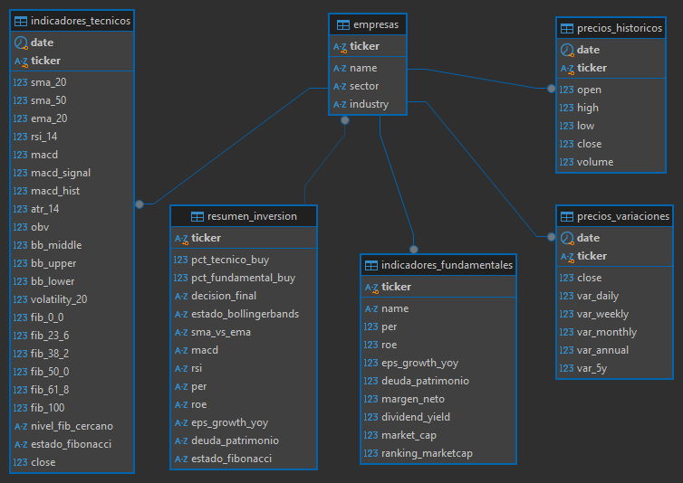

# ⚙️ ETL Proyecto Final - NYSE Acciones

---

## 🔥 Flujo ETL Implementado

### 1. Extracción
- Lista de tickers del S&P 500 desde Wikipedia.
- Datos históricos de precios diarios usando yfinance.
- Información fundamental actualizada para cada empresa.

### 2. Transformación
- Limpieza de nombres de columnas.
- Conversión de formatos de fecha.
- Cálculo de indicadores técnicos: SMA, EMA, RSI, MACD, ATR, OBV, Bollinger Bands, Volatilidad, niveles de Fibonacci.
- Enriquecimiento de fundamentales con ranking de capitalización.
-	Cálculo de señales de compra/venta en resumen_inversion_ready.csv.
- Calculo de variaciones diarias, semanal, mensual, anual y cada 5 años en precios_variocion.csv

### 3. Carga
- Inserción incremental en tablas PostgreSQL:
  - `empresas`
  - `precios_historicos`
  - `indicadores_fundamentales`
  - `indicadores_tecnicos`
  - `resumen_inversion`
  - `precios_variaciones`     
- Evita duplicados.
- Detecta nuevos registros automáticamente.

---

## 🗂️ Estructura de Archivos

| Archivo | Función |
|:---|:---|
| `ext.py` | Extracción inicial de datos |
| `ext_diario.py` | Actualización diaria de nuevos datos |
| `transform.py` | Transformación de datos crudos |
| `load.py` | Carga incremental a PostgreSQL |
| `main.py` | Orquestación de todo el pipeline |

---

## 🧪 Resultado

- **Dataset limpio** y actualizado diariamente.
- **Carga eficiente** con control de duplicados.
- **Base de datos lista** para analítica avanzada y visualizaciones.

---