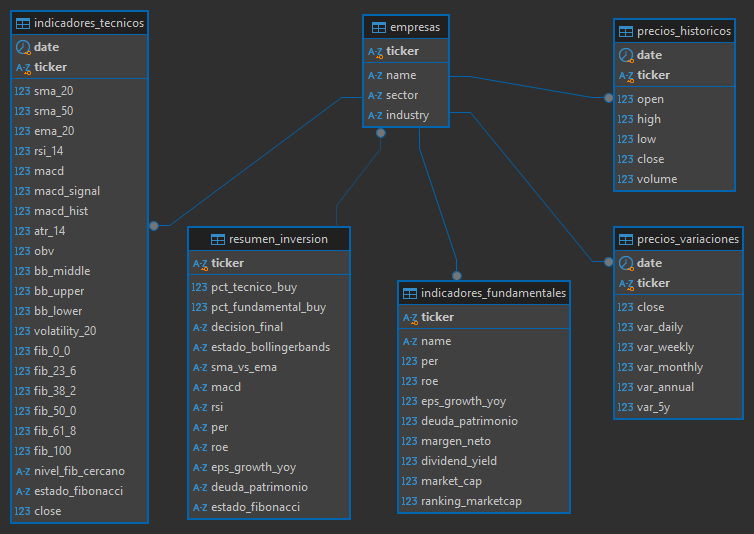

# 📚 Pipeline ETL de Datos Financieros

## 📋 Descripción General

Este proyecto implementa un pipeline ETL completo para la recolección, transformación y carga de datos del mercado financiero (Top 500 empresas del S&P 500) usando **Python** y **PostgreSQL**.

El objetivo es construir una base de datos lista para el análisis de precios históricos, fundamentos financieros y cálculos de indicadores técnicos junto con niveles de Fibonacci.

---

## 🛠️ Herramientas y Tecnologías

- **Python 3.12**
- **Librerías:**
  - pandas
  - numpy
  - yfinance
  - psycopg2
  - tqdm
  - python-dotenv
- **Base de datos:** PostgreSQL
- **IDE:** Visual Studio Code
- **Administrador DB:** DBeaver

---

## 🔥 Estructura del Pipeline

### 1. Extracción

- **Scripts:** `ext.py` y `ext_diario.py`
- **Tecnología:** `yfinance`, `pandas`
- **Descripción Técnica:**
  - Se extrae la lista de tickers del S&P 500 desde Wikipedia.
  - Se descargan los precios históricos y datos fundamentales de cada acción usando la API de Yahoo Finance.
  - `ext_diario.py` implementa actualizaciones incrementales diarias, evitando redundancia de datos.

---

### 2. Transformación

- **Script:** `transform.py`
- **Tecnología:** `pandas`, `numpy`
- **Descripción Técnica:**
  - Normalización y limpieza de datasets.
  - Cálculo de indicadores técnicos (SMA, EMA, RSI, MACD, Bollinger Bands, ATR, OBV).
  - Cálculo de ranking de capitalización de mercado para las empresas.
  - Reducción de precisión a 3 decimales en precios para optimizar el almacenamiento.
  - Estandarización de fechas y columnas.
  -	Cálculo de señales de compra/venta en resumen_inversion_ready.csv.
  - Calculo de variaciones diarias, semanal, mensual, anual y cada 5 años en precios_variocion.csv

---

### 3. Carga

- **Script:** `load.py`
- **Tecnología:** `psycopg2`, `PostgreSQL`
- **Descripción Técnica:**
  - Inserción inicial y actualización incremental basadas en control de fechas (UPSERT por fecha y ticker).
  - Control de duplicados en históricos y técnicos.
  - Optimización con transacciones y cargas por lotes (batch insert).

---

### 4. Orquestación

- **Script:** `main.py`
- **Descripción Técnica:**
  - Ejecución secuencial de: actualización diaria → transformación → carga.
  - Totalmente listo para ser agendado vía cron job o similar.

---

## 🛡️ Reproducibilidad y Eficiencia

### Reproducibilidad
- El pipeline es totalmente reproducible desde cero con los scripts provistos (`ext.py` + `transform.py` + `load.py`).
- No requiere configuración manual fuera del archivo `.env` para credenciales de base de datos.

### Eficiencia
- Descarga de datos usando `threads=True` en `yfinance`.
- Carga incremental que solo procesa nuevos registros.
- Reducción de tamaño de archivos eliminando decimales innecesarios.
- Git limpio gracias al uso de `.gitignore` para archivos pesados.

---

## 📦 Datasets Finales

| Dataset                          | Contenido                                                        |
|-----------------------------------|-------------------------------------------------------------------|
| `empresas_ready.csv`              | Información de empresas (ticker, nombre, sector, industria).     |
| `precios_historicos_ready.csv`    | Precios diarios OHLCV.                                            |
| `indicadores_fundamentales_ready.csv` | PER, ROE, EPS growth, Margen Neto, Dividend Yield.         |
| `indicadores_tecnicos_ready.csv`  | SMA, EMA, RSI, MACD, Bollinger Bands, ATR, OBV, Volatilidad.      |
| `precios_variacion_ready`         | Calculo de variaciones diarias, semanal, mensual, anual y cada 5 años |
| `resumen_inversion.csv`           | Decision Final de compra o venta para cada indicador tec y fund  |

---

## 📈 Próximos Pasos

- Análisis EDA sobre ficheros.
- Construcción de dashboards de análisis financiero en Power BI.
- Desarrollo de modelos predictivos sobre precios históricos.
- Detección automática de señales de compra/venta basadas en indicadores.

---

