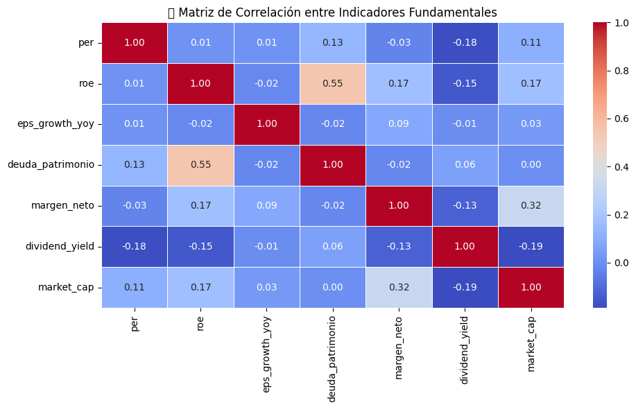
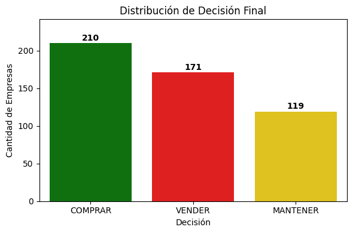
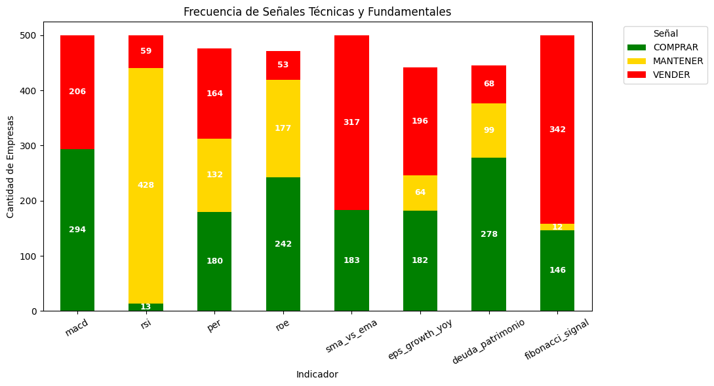
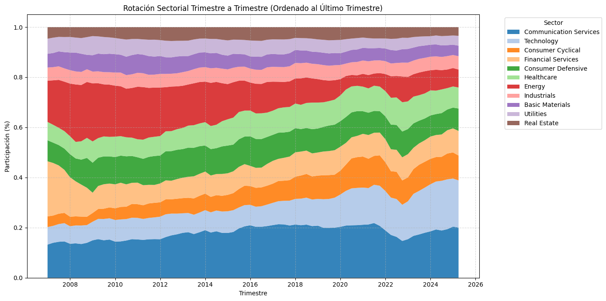

# 📊 Informe de Análisis Exploratorio de Datos (EDA)

## 🧭 1. Introducción

Este informe documenta los hallazgos derivados del análisis exploratorio de datos (EDA) realizado sobre datos financieros extraídos desde una base PostgreSQL. El objetivo es comprender la estructura, calidad y comportamiento de las variables clave para el diseño de soluciones analíticas (dashboards, modelos de scoring o estrategias de inversión).

---

## 🛠️ 2. Metodología

Se utilizó Python como herramienta principal, integrando las siguientes técnicas:

- 🗃️ Conexión y extracción desde PostgreSQL (`psycopg2`)
- 🧹 Limpieza de datos con `pandas`, `numpy` y visualización de valores nulos con `missingno`
- 📈 Visualización estadística con `matplotlib`, `seaborn`
- 🔎 Análisis de outliers, correlaciones, rotación sectorial y decisiones de inversión
- 📆 Agrupación temporal por trimestre, año y sector para evaluar evolución y participación

---

## 🔍 3. Resultados del EDA

### 🚫 3.1 Valores Faltantes

- `EPS Growth YoY` y `Dividend Yield` presentan entre 18% y 30% de nulos.
- Se recomienda imputación sectorial o eliminación condicional según el modelo.

---

### 📉 3.2 Distribuciones y Outliers

- Outliers severos en `PER` (>8000), `ROE` (>16), `Deuda/Patrimonio` (>3000).
- Transformaciones logarítmicas y winsorización recomendadas para modelado.
- Algunos sectores (Technology, Real Estate) concentran la mayoría de los casos extremos.

---

### 🔗 3.3 Correlación entre Variables

- `ROE` y `Deuda/Patrimonio` con correlación positiva moderada (0.55)
- `Dividend Yield` tiende a estar negativamente correlacionado con `Market Cap` y `PER`
- Se validó independencia entre varias métricas, ideal para enfoques multifactoriales

---

### 📈 3.4 Análisis Sectorial

#### Indicadores por Sector
- **Technology** y **Healthcare** sobresalen en ROE y crecimiento EPS
- **Utilities** y **Basic Materials** presentan perfiles conservadores
- EPS Growth muestra alta dispersión especialmente en Industrials y Tech

#### Outliers por Sector

| Sector         | EPS Growth | PER | ROE |
|----------------|------------|-----|-----|
| Technology     | 5          | 2   | 3   |
| Consumer Cyc.  | 1          | 5   | 1   |
| Healthcare     | 0          | 1   | 4   |

---

### 🧠 3.5 Señales Técnicas y Decisiones

- Decisión final: 210 COMPRAR, 171 VENDER, 119 MANTENER
- Señales más agresivas: Fibonacci (342 ventas), SMA/EMA (317 ventas)
- RSI entrega mayoría de señales neutrales (428 MANTENER)

---

### 💰 3.6 Retorno y Volatilidad por Sector

| Sector         | Retorno Anual (%) | Volatilidad Anual |
|----------------|-------------------|--------------------|
| Technology     | 21.2              | 0.22               |
| Consumer Cyc.  | 19.8              | 0.20               |
| Utilities      | 10.9              | 0.11               |

- Alta rentabilidad y alta volatilidad: **Technology**, **Consumer Cyclical**
- Estabilidad y bajo riesgo: **Utilities**, **Real Estate**, **Defensive**

---

### 🔄 3.7 Rotación Sectorial Trimestral

- Communication Services y Consumer Cyclical han ganado participación desde 2018
- Tecnología pierde peso relativo post-2022, mientras Energy se recupera desde 2021
- Healthcare se mantiene como ancla estable durante todo el período

---

## 🧠 4. Conclusiones y Recomendaciones

- 📉 El dataset es robusto pero requiere tratamiento de nulos, outliers y escalado
- 📊 Las variables fundamentales tienen bajo solapamiento → ideal para modelos combinados
- 🔄 Se observan dinámicas de rotación sectorial aprovechables para estrategia top-down
- 🧠 Se recomienda segmentar análisis por sector, aplicar imputación contextual y evaluar interacciones entre señales técnicas y fundamentales

---

> 🔧 Este informe es la base para construir modelos de clasificación, portafolios inteligentes o dashboards de monitoreo financiero sectorial.
